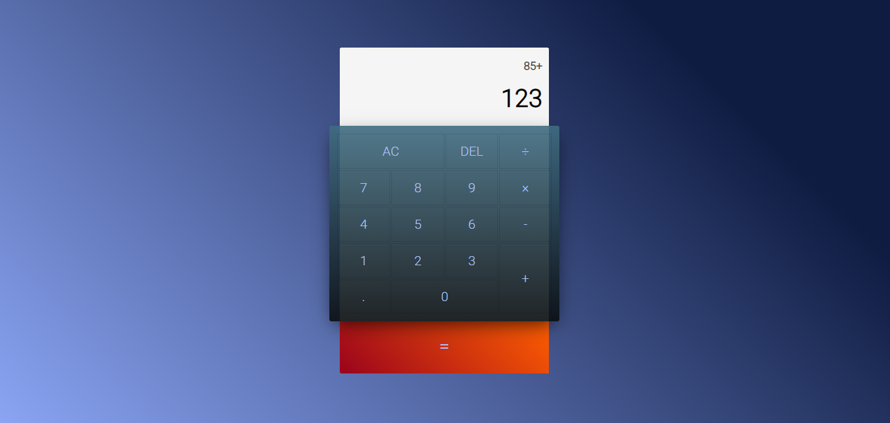
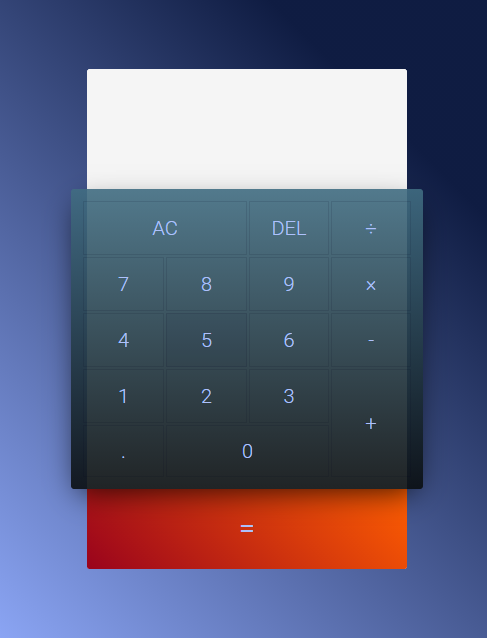

<p align="center"> 
  
</p>

<h1 align="center">🧮 CALCULADORA 🧮</h1> <a name="sobre"> </a>
<p align="center"> <a name="descricao"></a>Nesse projeto foi desenvolvido uma aplicação web que consiste em uma calculadora simples do qual executa algumas operações matemáticas básicas de multiplicação, divisão, subtração e soma.</p>

<p align="center"><code> <a name="status"></a><i>🚀 Status: Finalizado 🚀</i> </code ></p>
<br>
<p align="center">
  
  <a href="https://github.com/RodrigoMoreiraDaSilva/Calculadora/issues">
    
  </a>
  <a href="https://github.com/RodrigoMoreiraDaSilva/Calculadora/blob/main/LICENSE">
    
  </a>
  <a href="https://github.com/RodrigoMoreiraDaSilva/Calculadora/network">
    
  </a>
  <a href="">
    
  </a>
</p>

****

# 📖 ÍNDICE

- [ℹ️ Sobre](#sobre)
  - [📰 Descrição do projeto](#descricao)
  - [🔖 Status do projeto](#status)
- [⚙️ Recursos](#recursos)
- [🎬 Demonstração](#demonstracao)
- [📲 Como visualizar](#como-visualizar)
- [🛠 Tecnologias utilizadas](#tecnologias-utilizadas)
- [👨🏽‍💻 Autor](#autor)

****

## <a name="recursos"></a> ⚙️ RECURSOS

- [x] Interface de usuário moderno e responsivo;
- [x] Execução de operações matemáticas básicas;
- [x] Exibição do número atual e do número anterior;
- [x] Botão de deletar que apaga o último caracter digitado;
- [x] Botão de resultado que exibe na calculadora o resultado da operação;
- [x] Se o usuario digitar um número maior que 14 digitos, uma mensagem de erro é exibida;
- [x] Há o botão de "apagar tudo" que limpa o output e deixa vazio o numero atual e anterior;
- [x] Há a limitação de digitos que impede o usuário de digitar um número de até no máximo 14 digitos;
- [x] A calculadora faz a operação matematica automaticamente caso o usuário clique em um simbolo matematico sem ter clicado em resultar;

## <a name="demonstracao"></a>🎬 Demonstração

<p align="left">
  
  
</p>


## 📲 COMO VISUALIZAR <a name="como-visualizar"> </a>

**Há duas Alternativas:**
- A primeira alternativa é acessando um link direto para o projeto hospedado. Nesse caso, pode acessar o projeto clicando nesse [link](calculadora-git-main-rodrigomoreiradasilva.vercel.app/calculadora.html).

- A segunda alternativa é clonando o projeto em sua máquina local: Para isso, no terminal, execute os seguintes comandos:

```
# Criar clone local do projeto
$ git clone https://github.com/RodrigoMoreiraDaSilva/Calculadora.git

# Entrar no diretório
$ cd Calculadora
```

- Com o projeto/repositório clonado em sua máquina local, abra o arquivo `calculadora.html` em seu navegador de preferência e então se divirta executando as operações matemáticas.
  
## <a name="tecnologias-utilizadas"></a> 🛠 Tecnologias Utilizadas
[](https://developer.mozilla.org/en-US/docs/Web/JavaScript)
[](https://developer.mozilla.org/pt-BR/docs/Web/HTML)
[](https://developer.mozilla.org/pt-BR/docs/Web/CSS)

### 👨🏽‍💻 AUTOR <a name="autor"></a>
*****

<h5>Rodrigo Moreira 🌠</h5>
<p>🌐Desenvolvido por <b> <i>Rodrigo Moreira da Silva</b> </i> 👨🏽‍💼❤️

[](https://twitter.com/psrodrigs)
[](https://www.linkedin.com/in/rodrigo-m0reira-da-silva/)

****
<p align="center">
    <b> <i> Copyright (c) 2021 Rodrigo Moreira da Silva </i> </b>
</p>
  <p align="center"> <a href="https://github.com/RodrigoMoreiraDaSilva/Layout-Do-Netflix/blob/master/LICENSE">  </a> </p>
